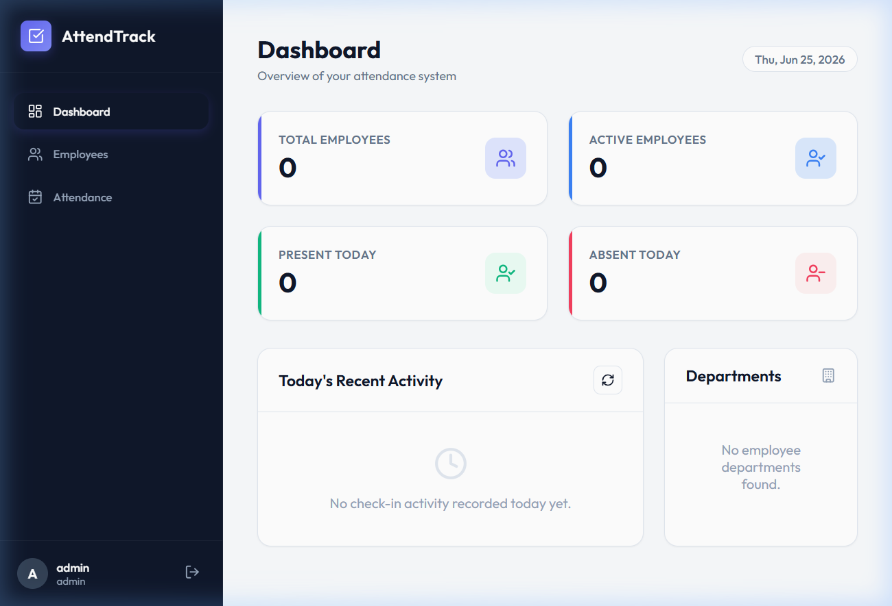
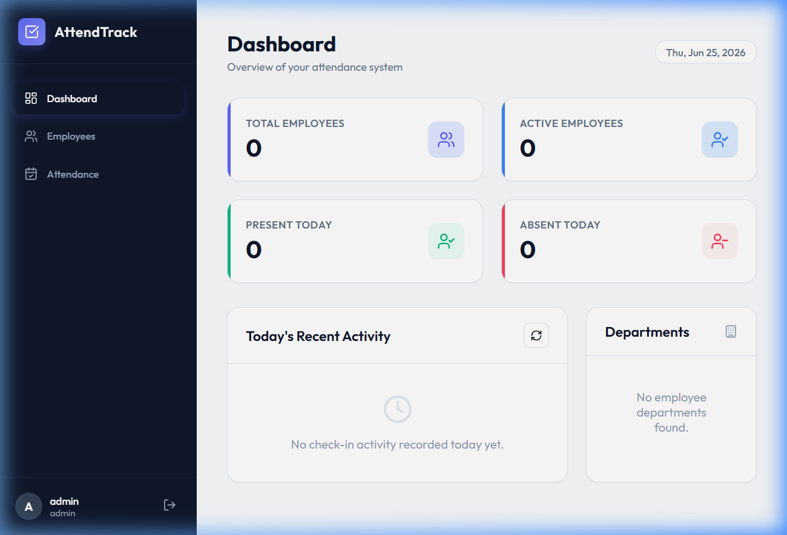
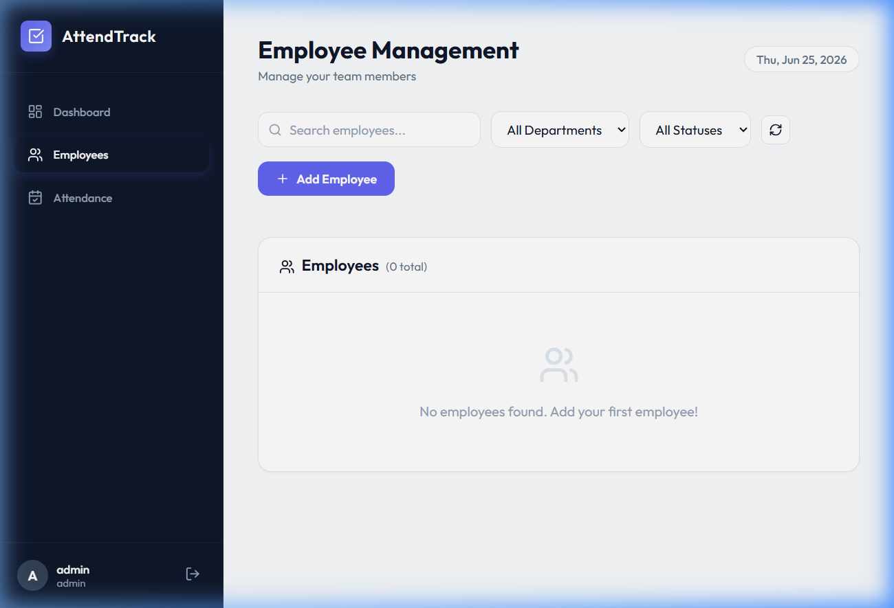
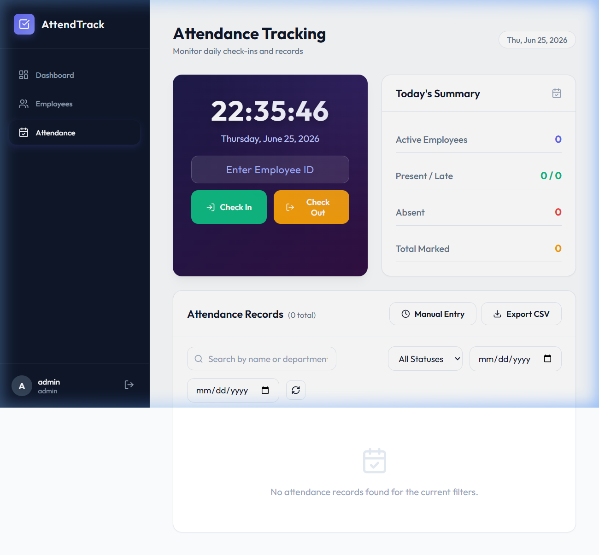

# AttendTrack – Mini Attendance Management System

A full-stack attendance management system built with **React.js**, **Node.js/Express**, and **MySQL**.

---

## 🚀 Quick Start

### Prerequisites
- **Node.js** v18 or later
- **npm** v9 or later
- **MySQL Server** installed and running on port 3306

### 1. Configure and Start the Backend

1. Make sure your MySQL Server is running. By default, the application connects to MySQL on `localhost:3306` with user `root` and password `root123`. 
2. If you need to use different credentials, create a `.env` file in the `backend` directory (or modify the defaults in `db.js`):
   ```env
   DB_HOST=localhost
   DB_PORT=3306
   DB_USER=root
   DB_PASSWORD=your_mysql_password
   DB_NAME=attendance_system
   ```
3. Run the following commands:
   ```bash
   cd backend
   npm install
   node server.js
   ```

The API server will start at **http://localhost:5000**

> On first startup, the application connects to MySQL, automatically runs `CREATE DATABASE IF NOT EXISTS attendance_system`, initializes all tables from `schema.sql`, and seeds a default admin account:
> - **Username:** `admin`
> - **Password:** `admin123`

### 2. Start the Frontend

Open a **second terminal**:

```bash
cd frontend
npm install
npm run dev
```

The React app will be available at **http://localhost:5173**

---

## 🗂 Project Structure

```
Mini attendance system/
├── backend/
│   ├── controllers/
│   │   ├── authController.js       # Login & registration logic
│   │   ├── employeeController.js   # Employee CRUD (search, sort, paginate)
│   │   ├── attendanceController.js # Check-in/out, history, CSV export
│   │   └── dashboardController.js  # Aggregate statistics
│   ├── middleware/
│   │   └── auth.js                 # JWT verification middleware
│   ├── routes/
│   │   ├── authRoutes.js
│   │   ├── employeeRoutes.js
│   │   ├── attendanceRoutes.js
│   │   └── dashboardRoutes.js
│   ├── db.js                       # MySQL pool connection & query helpers
│   ├── schema.sql                  # Database schema (submit this!)
│   ├── server.js                   # Express app entrypoint
│   ├── verify.js                   # API end-to-end test script
│   └── package.json
└── frontend/
    ├── src/
    │   ├── context/
    │   │   └── AuthContext.jsx     # Global auth state (JWT session)
    │   ├── services/
    │   │   └── api.js              # All API calls in one place
    │   ├── components/
    │   │   └── Sidebar.jsx         # Navigation sidebar
    │   ├── pages/
    │   │   ├── Login.jsx           # Glassmorphism login screen
    │   │   ├── Dashboard.jsx       # Stats, department chart, recent activity
    │   │   ├── Employees.jsx       # Full CRUD with modals, search, pagination
    │   │   └── Attendance.jsx      # Live clock console + log table + CSV export
    │   ├── App.jsx                 # Root component & page router
    │   ├── main.jsx                # React entry point
    │   └── index.css               # Premium design system (CSS variables, animations)
    └── package.json
```

---

## 🔧 How It Works – Concepts Explained

### 1. Authentication (JWT)
When you log in, the backend:
1. Looks up your username in the `users` table
2. Uses **bcrypt** to compare your password against the stored hash
3. If matched, signs a **JWT** token with your user ID and role, valid for 8 hours
4. The frontend stores this token in `localStorage`
5. Every subsequent API request includes the token in the `Authorization: Bearer <token>` header
6. The `auth.js` middleware verifies the token on protected routes

### 2. Database (MySQL + Schema)
Three main tables:
- **`users`** – admin accounts with hashed passwords
- **`employees`** – employee records (employee_id, name, email, dept, etc.)
- **`attendance`** – daily check-in/out logs linked to employees via `employee_id` foreign key

A `UNIQUE (employee_id, date)` constraint ensures only one attendance record per employee per day.

### 3. Employee Management
The `GET /api/employees` endpoint accepts query parameters for:
- **Search** (`?search=John`) – searches across name, email, employee_id, mobile
- **Filter** (`?department=Engineering&status=Active`)
- **Sort** (`?sortBy=name&sortOrder=ASC`) – server-side, sanitized to prevent SQL injection
- **Paginate** (`?page=2&limit=10`) – returns `pagination` metadata alongside results

### 4. Attendance Logic
- **Check-In**: Creates a new attendance record. Status is automatically set to `Late` if check-in time is after 09:15 AM.
- **Check-Out**: Updates the existing record for today with the check-out time.
- **"Absent" calculation**: Not a stored value — it's computed dynamically as `Active Employees − Checked-In Employees`.
- **CSV Export**: The backend builds a CSV string server-side and sends it with `Content-Disposition: attachment` headers so the browser downloads it directly.

### 5. Frontend State Management
- **AuthContext** (`React.createContext`) stores the logged-in user globally. All pages access it via the `useAuth()` hook.
- **`api.js`** is a centralized service that auto-attaches JWT headers and handles response parsing.
- Each page uses `useEffect` + `useCallback` for data fetching, with debouncing on search inputs to avoid excessive API calls.

---

## 🌐 API Reference

### Auth
| Method | Endpoint | Description |
|--------|----------|-------------|
| POST | `/api/auth/login` | Authenticate user, returns JWT |
| POST | `/api/auth/register` | Create new admin account |

### Employees *(requires JWT)*
| Method | Endpoint | Description |
|--------|----------|-------------|
| GET | `/api/employees` | List employees (search, filter, sort, paginate) |
| GET | `/api/employees/:id` | Get one employee |
| POST | `/api/employees` | Create employee *(admin only)* |
| PUT | `/api/employees/:id` | Update employee *(admin only)* |
| DELETE | `/api/employees/:id` | Delete employee + cascade attendance *(admin only)* |

### Attendance *(requires JWT)*
| Method | Endpoint | Description |
|--------|----------|-------------|
| POST | `/api/attendance/mark` | Check-in or check-out |
| GET | `/api/attendance` | List records (search, filter, sort, paginate) |
| GET | `/api/attendance/summary` | Today's present/absent/late counts |
| GET | `/api/attendance/employee/:id` | Individual employee history |
| GET | `/api/attendance/export` | Download CSV report |

### Dashboard *(requires JWT)*
| Method | Endpoint | Description |
|--------|----------|-------------|
| GET | `/api/dashboard/stats` | Aggregate stats + department distribution |

---

## 🧪 Running API Tests

With the backend server running, execute:

```bash
cd backend
node verify.js
```

Expected output: **18 passed, 0 failed**

---

## ✨ Features Implemented

| Feature | Status |
|---------|--------|
| JWT Authentication | ✅ |
| Employee CRUD | ✅ |
| Search & Filtering | ✅ |
| Sorting (all columns) | ✅ |
| Pagination | ✅ |
| Check-In / Check-Out | ✅ |
| Late Detection (after 9:15 AM) | ✅ |
| Attendance Summary | ✅ |
| Employee-wise History | ✅ |
| Manual Attendance Entry | ✅ |
| CSV Export | ✅ |
| Dashboard with Statistics | ✅ |
| Department-wise Distribution | ✅ |
| Role-Based Access (admin/employee) | ✅ |
| Responsive UI | ✅ |
| Glassmorphism Login Screen | ✅ |
| Live Clock Console | ✅ |
| API Verification Tests | ✅ |

---

## 📜 Default Credentials

| Field | Value |
|-------|-------|
| Username | `admin` |
| Password | `admin123` |

---

## 🖼️ Application Screenshots & Walkthrough

### 1. Login Page
*Premium glassmorphism card with real-time field validation.*


### 2. Dashboard
*Key metrics and interactive department distribution charts.*


### 3. Employee Management
*Interactive table displaying employee details with multi-field search, filters, pagination, and modal-based CRUD.*


### 4. Attendance Management
*Real-time local clock console for checking in/out, status classification, log table, and CSV report export.*

